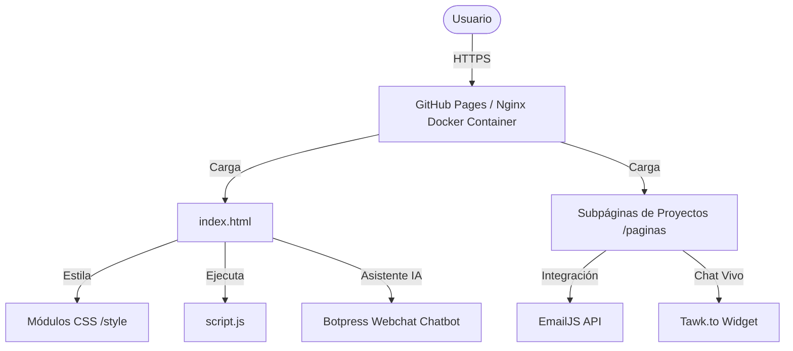

# Resumen de Arquitectura Web: Portafolio Personal

Este documento describe el diseño, la estructura de directorios, el flujo de datos y el modelo de despliegue del sitio web portafolio ([RaulTrelles.github.io](file:///C:/Informacion/Desarrollo/Frontend/RaulTrelles.github.io)).

---

## 1. Vista General del Sistema

El sitio está diseñado como un **sitio web estático multipágina** optimizado para un rendimiento rápido, adaptabilidad móvil (diseño responsivo) y una interfaz de usuario interactiva sin la sobrecarga de un framework SPA (React/Vue).



---

## 2. Estructura de Directorios y Modularidad

El código se organiza siguiendo un patrón limpio de separación de intereses (HTML, CSS y JS):

```
📂 RaulTrelles.github.io/ (Raíz del proyecto)
├── 📄 index.html                     # Página principal (Secciones: Inicio, Acerca de, Tecnologías, Portafolio, Experimentos)
├── 📄 Dockerfile                     # Configuración del contenedor Docker para despliegue independiente
├── 📂 style/                         # Capa de presentación (Hojas de estilo modulares)
│   ├── 📄 fondo.css                  # Variables de diseño (:root, colores primarios, tipografías base)
│   ├── 📄 style.css                  # Estilos principales de secciones y media-queries responsivos
│   ├── 📄 menuprincipal.css          # Estructura y colapso responsive de la barra de navegación principal
│   ├── 📄 menusecundario.css         # Estructura del nav de las subpáginas
│   ├── 📄 boton.css                  # Estilización de botones flotantes e interactivos
│   ├── 📄 proyecto.css               # Plantilla de diseño para visualización de detalles de cada proyecto
│   └── 📄 ERP.css                    # Estilos específicos para las implementaciones ERP (listas, checks, radio buttons)
├── 📂 js/                            # Capa de comportamiento (Lógica de interacción)
│   └── 📄 script.js                  # Modales dinámicos, menús colapsables y efectos de cursor
├── 📂 paginas/                       # Páginas de proyectos detallados y contacto
│   ├── 📄 contactame.html            # Formulario de contacto integrado con EmailJS
│   ├── 📄 PortalERP.html             # Dashboard de proyectos ERP (Ofisis, Dynamics NAV, NetSuite, Odoo)
│   └── 📄 [Proyecto].html            # Páginas individuales de detalle de cada ERP y desarrollo Full Stack
└── 📂 img/                           # Archivos de recursos estáticos (SVG, PNG, JPG)
```

---

## 3. Componentes Clave e Integraciones

### 3.1 Capa de Estilo (Modular y Variable-Driven)

- **CSS Puro y Variables:** A través de [fondo.css](file:///C:/Informacion/Desarrollo/Frontend/RaulTrelles.github.io/style/fondo.css), la aplicación define variables globales como `--main-color` (`#ff9800`) que facilitan la personalización de la marca del portafolio de manera centralizada.
- **Responsive Design:** Utiliza consultas de medios (_media queries_) a lo largo de [style.css](file:///C:/Informacion/Desarrollo/Frontend/RaulTrelles.github.io/style/style.css) con puntos de quiebre estándar para garantizar una experiencia óptima en teléfonos inteligentes (≤520px), tabletas (541px a 820px) y computadoras de escritorio.

### 3.2 Capa de Comportamiento Dinámico

- **Modales Reactivos en Tecnologías:** En [script.js](file:///C:/Informacion/Desarrollo/Frontend/RaulTrelles.github.io/js/script.js), una estructura `switch-case` procesa los clicks en las tarjetas de tecnologías principales de la página web y renderiza el set específico de herramientas correspondientes (por ejemplo, lenguajes backend, herramientas de inteligencia de negocios, bases de datos) dentro de una única ventana modal reutilizable.

### 3.3 Integraciones de Terceros (Servicios Externos)

1. **Botpress Chatbot (Asistente IA):** Integrado en la cabecera de la página principal para interactuar automáticamente con visitantes e iniciar abierto de manera controlada.
2. **Tawk.to Chat (Chat en Vivo):** Integrado en [contactame.html](file:///C:/Informacion/Desarrollo/Frontend/RaulTrelles.github.io/paginas/contactame.html) para ofrecer soporte y comunicación síncrona en tiempo real.
3. **EmailJS (Envío de Formularios):** Permite procesar el formulario de contacto de manera asíncrona directamente a tu correo electrónico sin necesidad de implementar un backend/servidor propio (Serverless).

---

## 4. Estrategia de Despliegue (DevOps)

El portafolio está optimizado para dos modelos de despliegue:

1. **GitHub Pages (Producción Actual):**
   - Configuración completamente estática (Serverless) con hosting gratuito e instantáneo provisto por GitHub, ideal para portafolios personales por su alta disponibilidad y costes cero.
2. **Contenedorización (Docker):**
   - Cuenta con un [Dockerfile](file:///C:/Informacion/Desarrollo/Frontend/RaulTrelles.github.io/Dockerfile) que utiliza la imagen ligera oficial de **Nginx** (`nginx:latest`). Copia los archivos estáticos a la ruta `/usr/share/nginx/html` y expone el puerto estándar `80`. Esto permite empaquetar y alojar la web en cualquier nube pública (AWS, Google Cloud, Azure) de forma inmediata.
